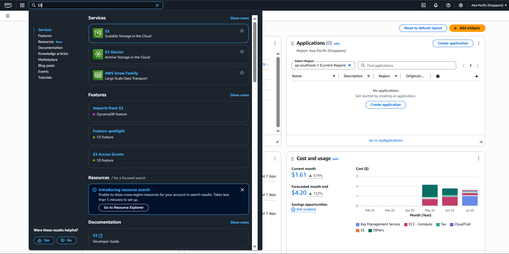
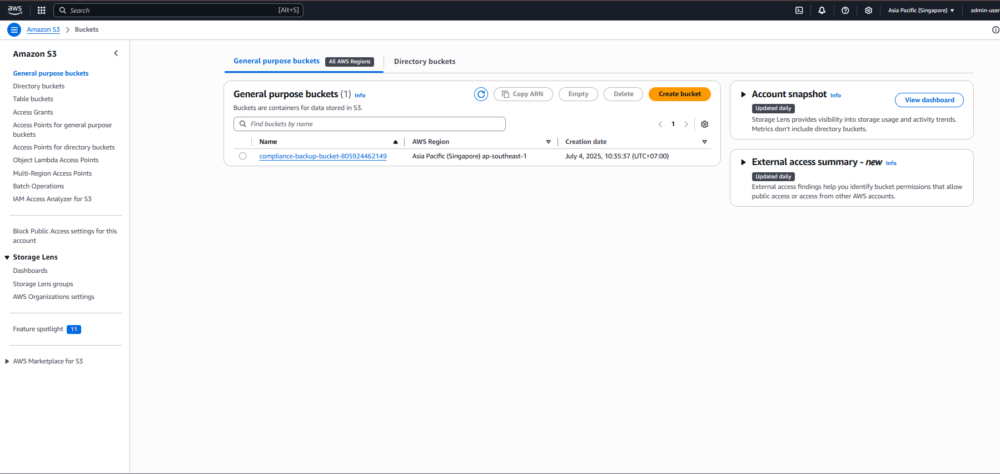
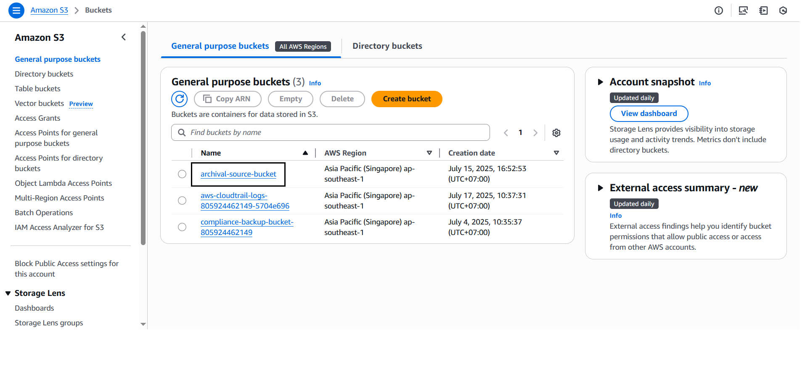
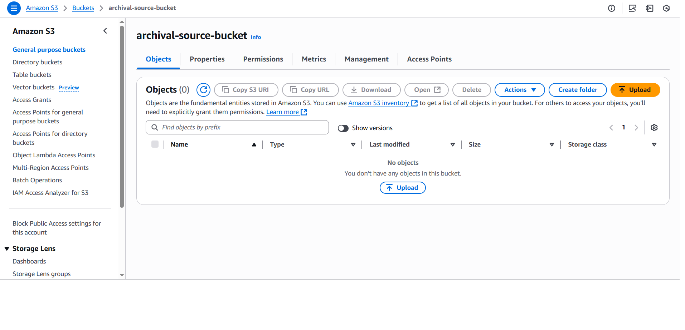
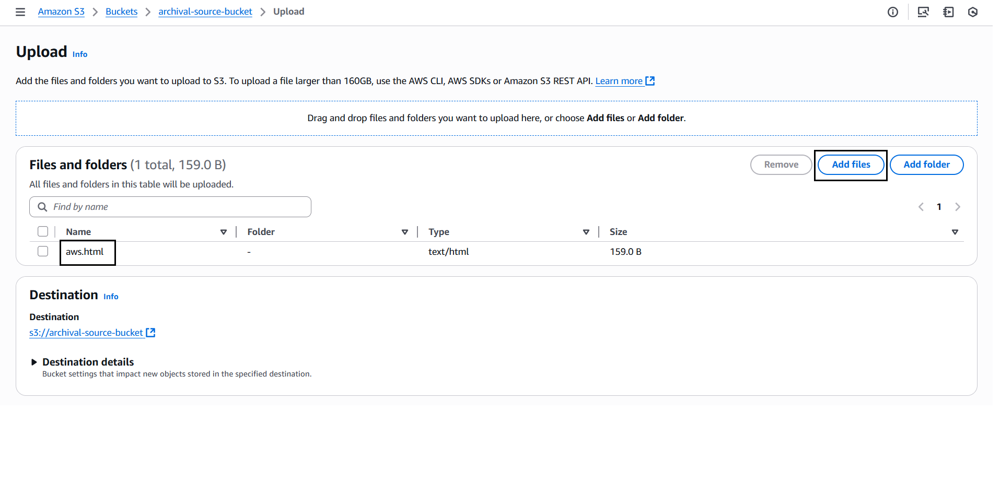
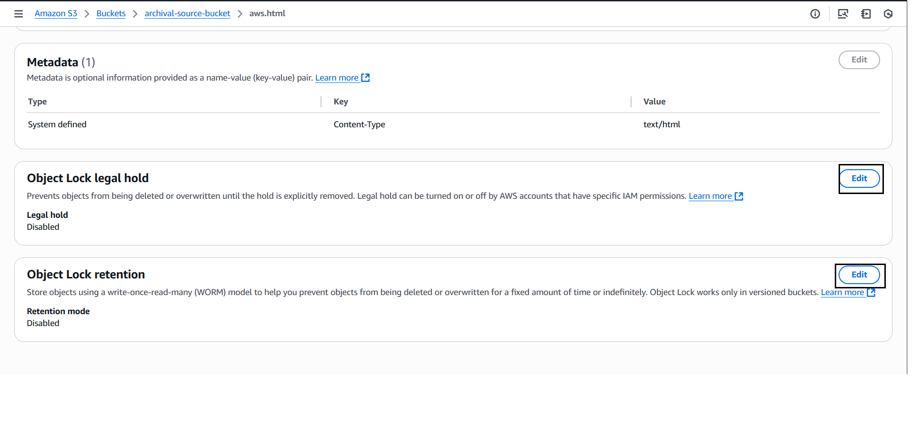
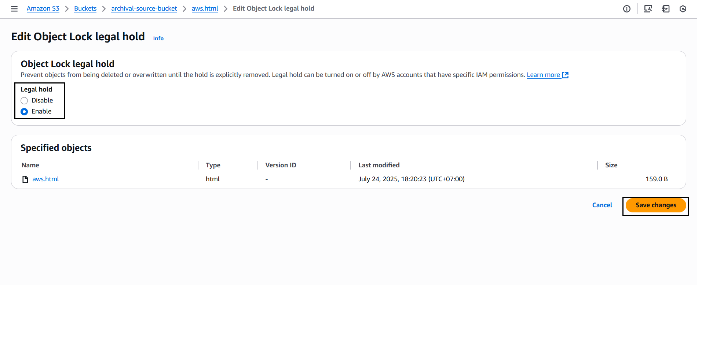
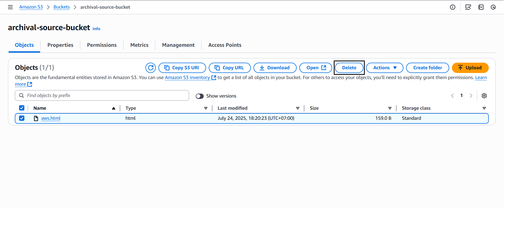
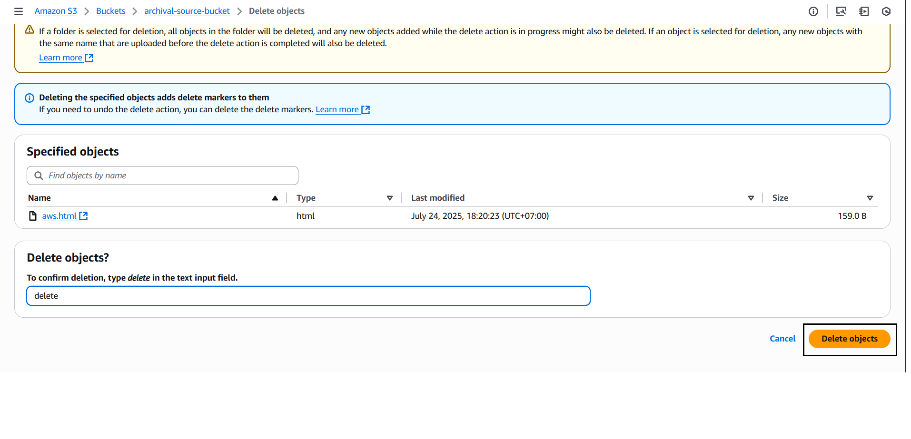
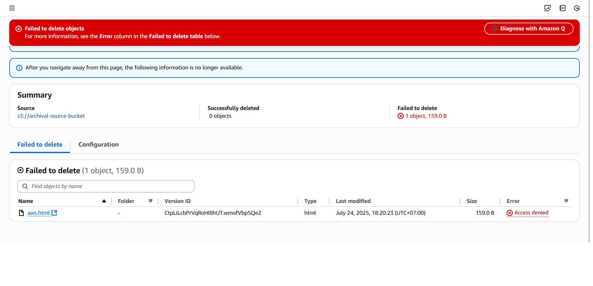

#### Create the Source S3 Bucket
Create a bucket in Amazon S3 to store the input data, which is where the automation process of storing data to Glacier begins.
1. Go to the [Amazon Web Service homepage](https://aws.amazon.com/) page.
2. Select **S3** service

1. Select **S3**, click ***Create Bucket***.

1. Enter information for the bucket to be created:
- Bucket name: `archival-source-bucket-<yourID>` to avoid confusion
- Object Ownership: leave as **default** (Bucket owner enforce)
- Block Public Access: keep **default** (**ALL enabled**)

- Enable **Versioning**: Tick “**Enable**”
- Enable **Object Lock**: Tick “**Enable**”
- Tick: "**I acknowledge that enabling Object Lock will permanently allow objects in this bucket to be locked.**"

- Select **Create Bucket**
- 
- Try adding an object to the bucket and setting a legal hold for that object

- **Legal hold**: 
  - Keep data for legal reasons (legal case, investigation).
  - No expiration date – keep indefinitely until discarded.
  - Can manually turn on/off each object.
- **Retention Policy**: 
  - Keep data for a certain period of time.
  - Has a specific term (e.g. 7 years).
  - Cannot be deleted or overwritten until expired.

