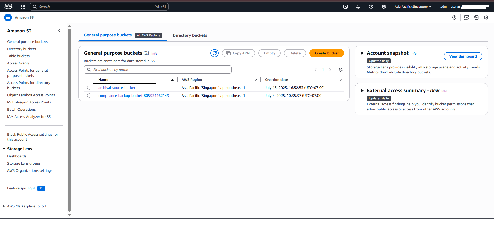
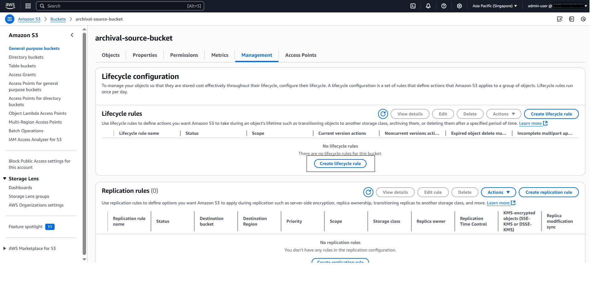
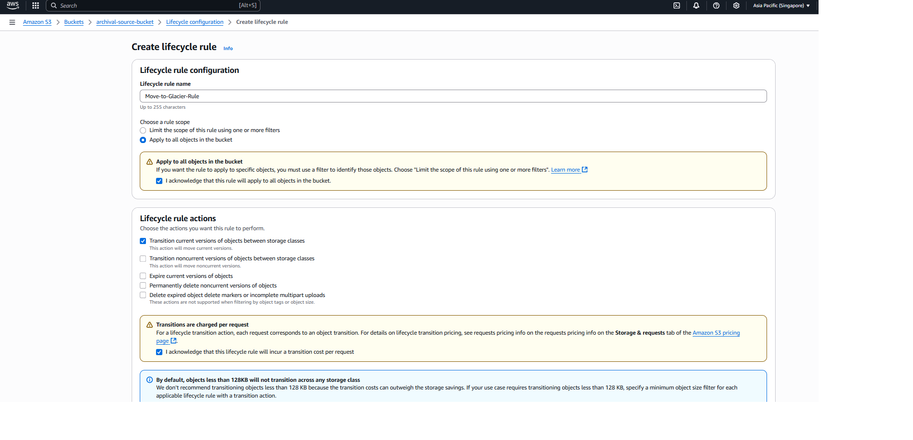
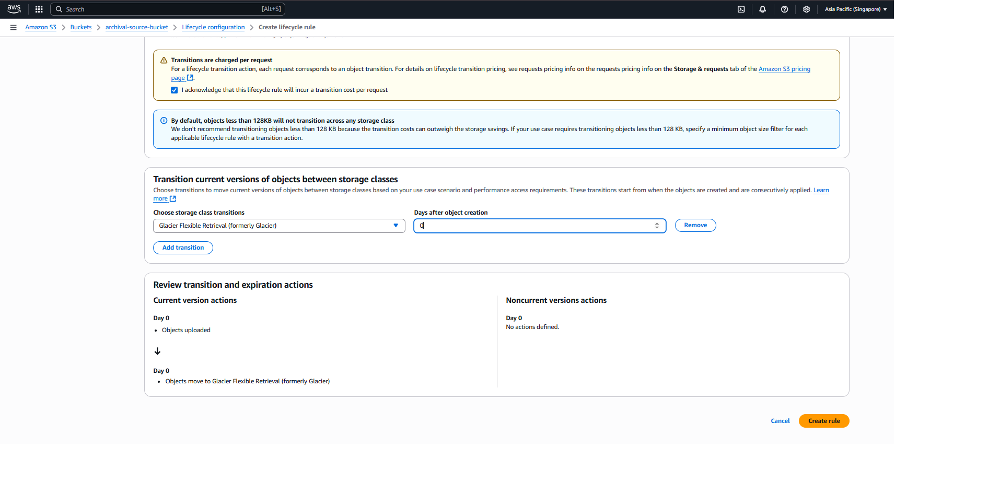
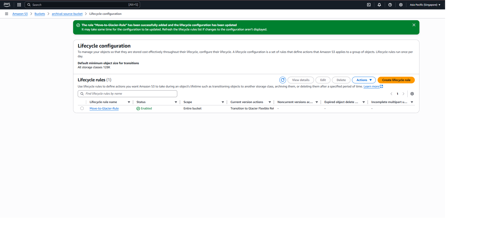

#### Objective
- Set up a policy to automatically move data from the source S3 Bucket (you created in Step 1) to S3 Glacier for long-term storage.
- Ensure the archival process is automated and consistent, serving compliance.

1. Go to AWS Console → S3 → go to the bucket archival-source-bucket.

2. Select the **Management** tab, Select Create lifecycle rule.

1. Configuration:
- Lifecycle rule name: `Move-to-Glacier-Rule`
- Choose a rule scope: **Apply to all objects in the bucket**
- Apply to all objects in the bucket: Tick on **I acknowledge that this rule will apply to all objects in the bucket.**
- Lifecycle rule actions: Tick **Transition current versions of objects between storage classes**.

4. Create Rule and Review

{}
This policy automates archival, aligning with compliance framework.
Glacier Vault Lock guarantees WORM compliance after objects are transitioned.
Objects in Glacier cannot be immediately deleted or altered due to Vault Lock policy.
{}