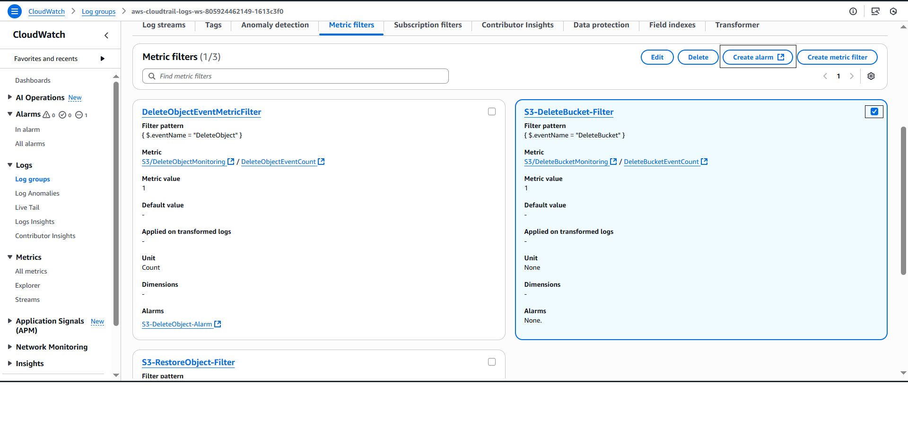

### Implement Monitoring, Auditing and Compliance Reporting

#### Enable AWS CloudTrail

1. Search **AWS CloudTrail** on AWS Console, Select **CloudTrail**

2. Select Trails, select **Create Trail**

3. Configuration:
- Trail name: `Trail name`
- Storage location: **Create new S3 bucket**
- Log file SSE-KMS encryption: **Enable**
- Customer managed AWS KMS key: **New**, AWS KMS alias: `archival-compliance-trail-key`
- Log file validation: **Enable**
- CloudWatch Logs - optional
  - CloudWatch Logs: **Enable**
  - Log group: **New**, Log group name: `aws-cloudtrail-logs-ws-< YourID >-1613c3f0`

- Select **Next**
- Choose log events
  - Events: tick on **Management events**, **Data events**
  - Management events: tick on **Read**, **Write**

- Select **Next**
- Review and **Create trail**

#### Configure AWS CloudWatch Monitoring
##### Create Metric Filter
1. Search **AWS CloudWatch** on AWS Console, Select **CloudWatch**

2. Select the log group containing the CloudTrail logs just created.

3. **Create Metric Filter**

4. Configuration for DeleteObject: 
- Filter pattern: `{ $.eventName = "DeleteObject" }`

- Select **Next**
- **Assign metric**
  - Filter name: `DeleteObjectEventMetricFilter`
  - Metric namespace: `S3/DeleteObjectMonitoring`
  - Metric name: `DeleteObjectEventCount`
  - Metric value: `1`
  - Default value: blank
  - Unit: **Count**

- Select **Next**
- Review and Create

1. Do the same with **DeleteBucket**

1. Do the same with **RestoreObject**

##### Create CloudWatch Alarm
1. Create Cloud Alarm for event **DeleteObject**
- Select that metric filter

- Specify metric and conditions
 - Threshold type: **Static**
 - Whenever DeleteObjectEventCount is...: **Greater**
 - than: **1**
- Select **Next**

- Configure actions:
 - Alarm state trigger: **In Alarm**
 - Send a notification to the following SNS topic: **Create new topic**
   - Topic name: `S3_DeleteObject_Alarm_Topic`
   - Email endpoint: `< Your email >`

   - **Create Topic** and Confirm your email via gmail 

   - Select **Next**  
 - Add alarm details:
   - Alarm name: `S3-DeleteObject-Alarm`
   - Alarm description: `# Track object deletion events on S3`
   - Select **Next**

 - Review and Create:

2. Create Cloud Alarm for event **DeleteBucket**

3. Create Cloud Alarm for event **RestoreObject**

