1. Delete trail created in **Cloudtrail**.
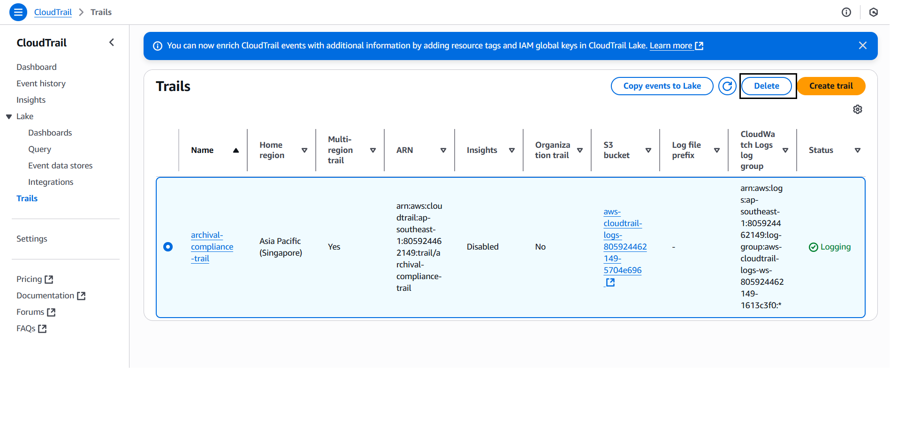
2. Empty and delete bucket log in S3.
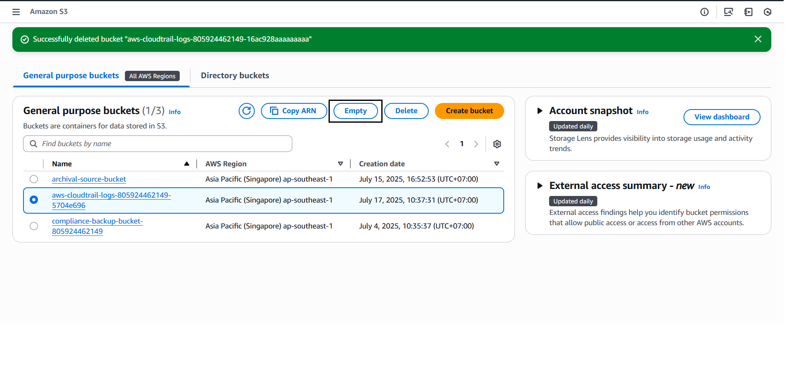
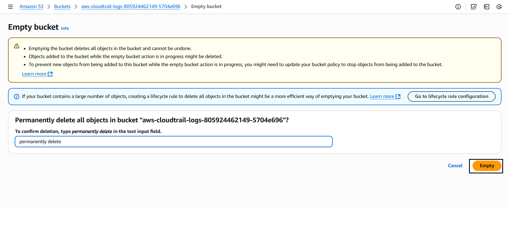
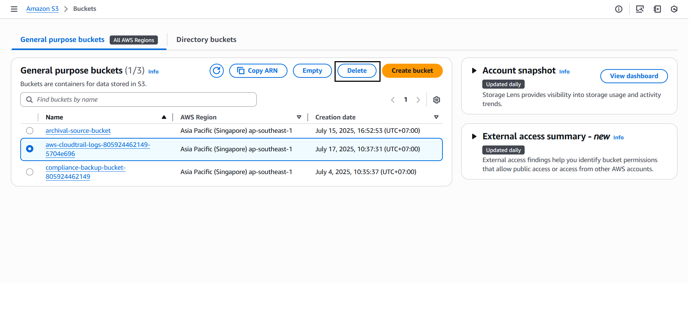
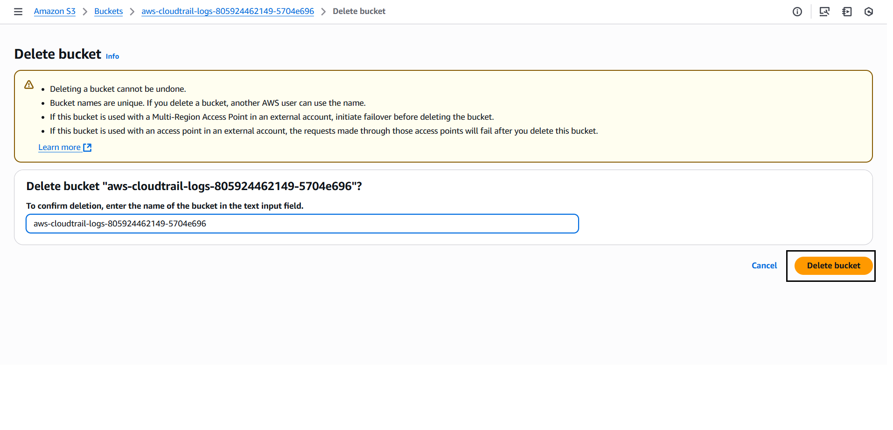
3. Delete related topics and subcriptions on SNS.
- Delete Topic: 
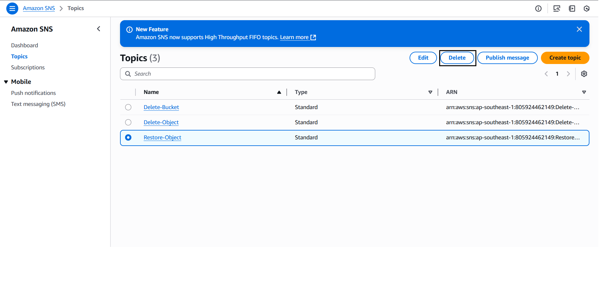
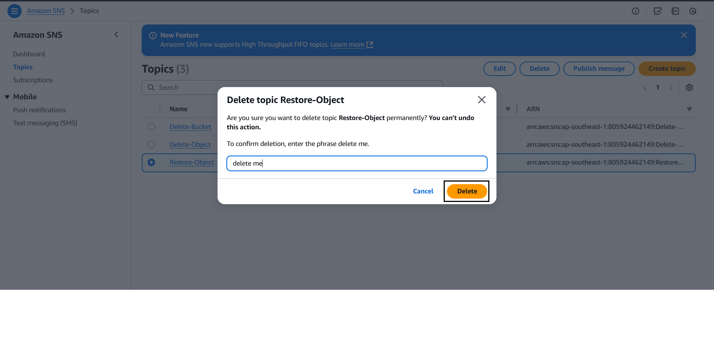
  - Do the same with **Delete Bucket**
  - Do the same with **Delete Object**
- Delete Subscription: 
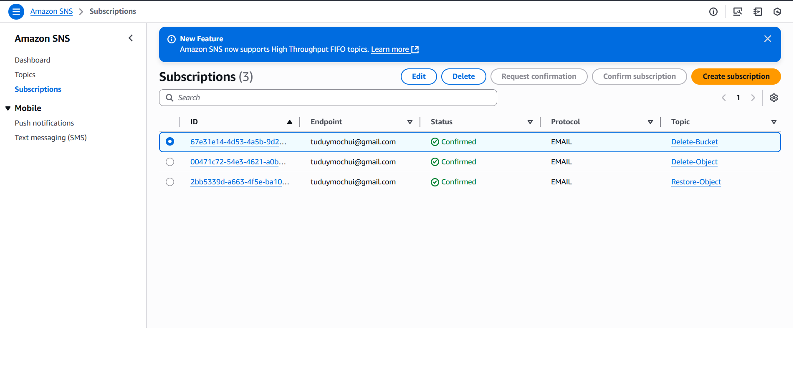
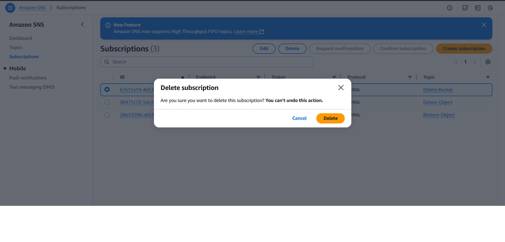
- Do the same with the rest.
4. Delete alarms created in CloudWatch.
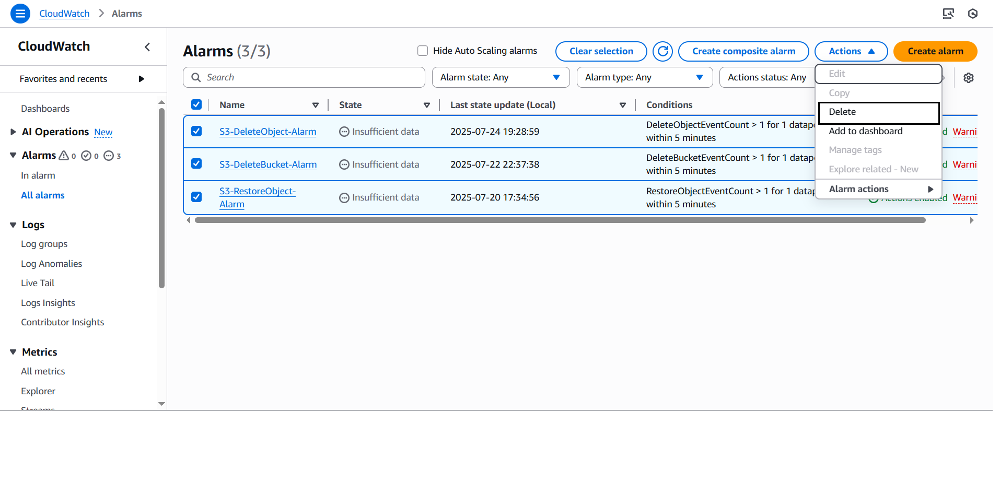
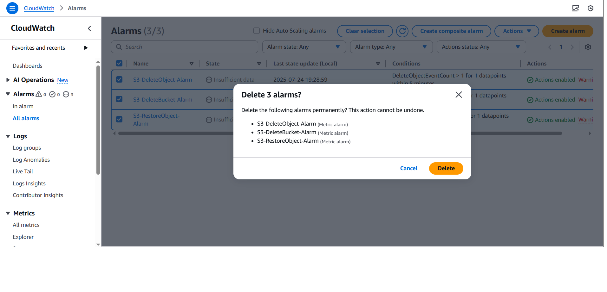
5. Empty and delete bucket used for automatic storage in S3.
- Empty bucket: 
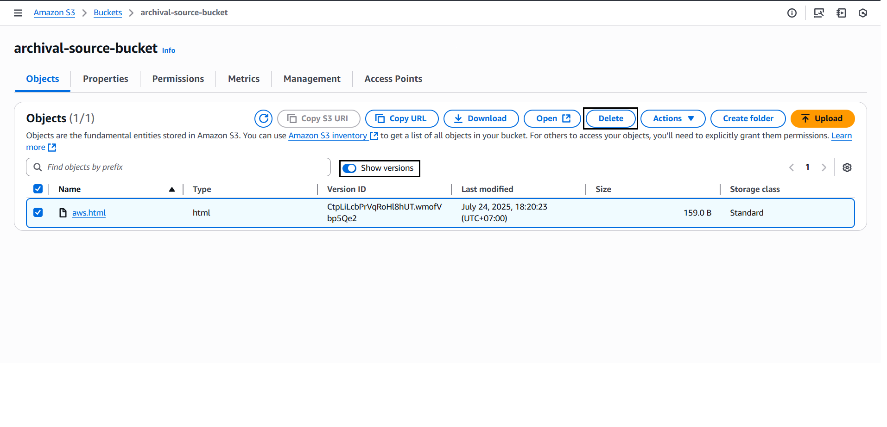
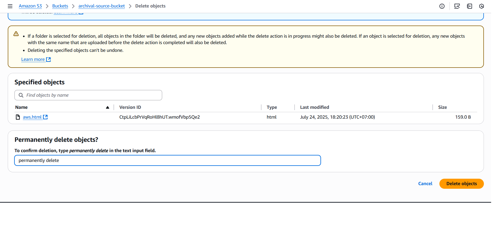
{}
Remember to turn off legal holds on objects and turn on object versioning to delete without errors.
{}
- Delete Bucket:
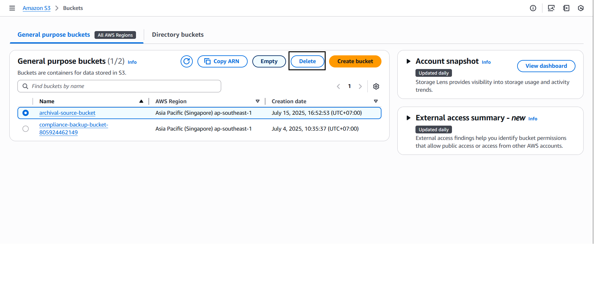
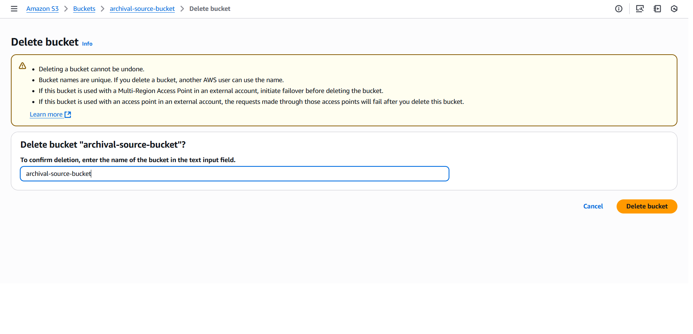